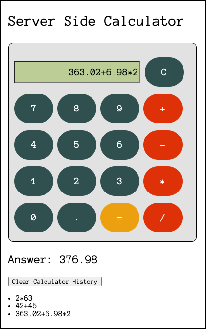

# Server Side Calculator

## Description

The objective of this stretch weekend challenge was to build a server-side calculator where the logic for the calculator had to be implemented on the server.

To see the fully functional calculator, please visit: <https://ancient-fjord-36573.herokuapp.com/>.

## Screen Shot

### Prerequisites

- [Node.js](https://nodejs.org/en/)

## Installation

In order to get the application up and running, do the following:

1. Download code locally from github.

2. Go to your terminal and type 'npm start'. This will start a local server on port 5000.

3. Go to your web browser and type 'localhost:5000'. This will bring up the calculator.

## Usage

1. Type a calculation into the calculator. This is done by typing one or more digits via the keypad, choosing an operator and then pressing the equal (=) button. For example, *3+9=*.

2. The answer will be displayed underneath the calculator and formatted as: *Answer: 27*.

3. The user can clear the console input by clicking on the clear button. The clear button is *C* on the calculator and is located next to the input screen.

4. Calculations will be added to a historical calculation list displayed under the answer.

5. The user can delete the calculation list by clicking on the *Clear Calculator History* button.

## Built With

- HTML
- CSS
- JavaScript
- Node.js
- AJAX

## Acknowledgement

- Thanks to our instructor, Dev Jana, for his valuable guidance and sense of humour. He makes learning web development fun and interesting. 
- Thanks to [Prime Digital Academy](www.primeacademy.io) for providing all Prime students with the opportunity to make substantial changes in their lives by learning how to program and how to think like a programmer.

## Support

- Thank you to the Ionian cohort students. I am humbled and grateful to learn with such an amazing cohort of Prime people. They always bring their 'A' game, smiles and encouragement to each lecture and group session.
- Thank you to my kids for pushing me to make my calculator look and work like the "real" thing. They are my toughtest critics when it comes to web application development.

If you have suggestions or issues, please email me at <jenny_alexander@icloud.com>.